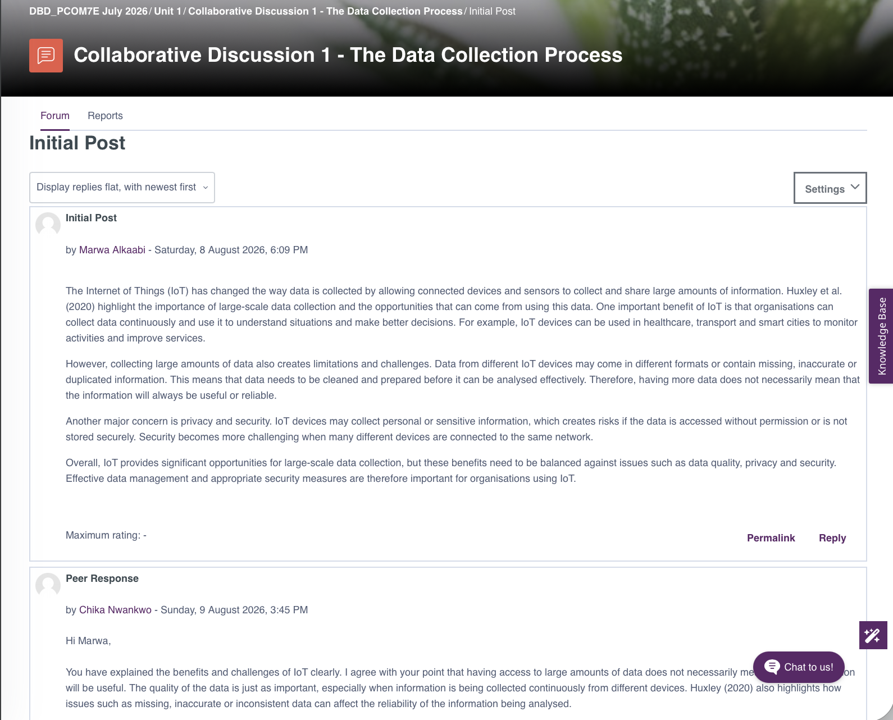

# Deciphering Big Data

## Module Overview

This e-portfolio documents my learning and development throughout the Deciphering Big Data module. It contains selected artefacts from the module activities, collaborative discussions, practical work and assessments, together with reflections on the knowledge and skills I developed.

## Unit 1: Introduction to Big Data Technologies and Data Management

### Collaborative Discussion 1 – The Data Collection Process

In Unit 1, I participated in the collaborative discussion on the use of Internet of Things (IoT) technologies for large-scale data collection. I considered the opportunities provided by connected devices alongside challenges relating to data quality, privacy and security.

The discussion helped me understand that collecting larger volumes of data does not necessarily result in more useful or reliable information. Issues such as missing, inaccurate and duplicated data can affect subsequent analysis and therefore require appropriate data preparation and management.

Peer feedback also encouraged me to consider practical approaches for reducing IoT security risks, including authentication, encryption, software updates and monitoring. This helped me recognise how peer discussion can identify areas where my initial analysis can be developed further.

### Evidence

- Initial post for Collaborative Discussion 1
  

- Peer response received on my initial post

## Unit 2

To be completed.

## Unit 3

To be completed.

## Unit 4

To be completed.

## Unit 5

To be completed.

## Unit 6

To be completed.

## Unit 7

To be completed.

## Unit 8

To be completed.

## Unit 9

To be completed.

## Unit 10

To be completed.

## Unit 11

To be completed.

## Unit 12

To be completed.

## Final Project Evaluation

To be completed.

## Professional and Personal Development

To be completed.

## Critical Reflection

To be completed.
