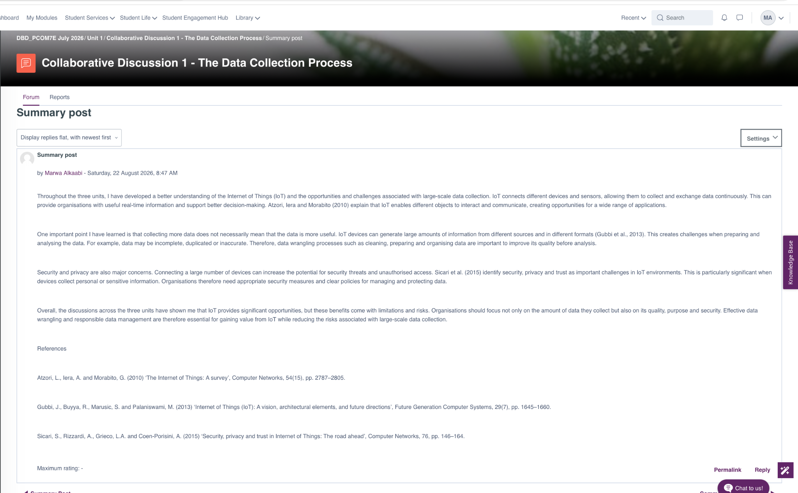
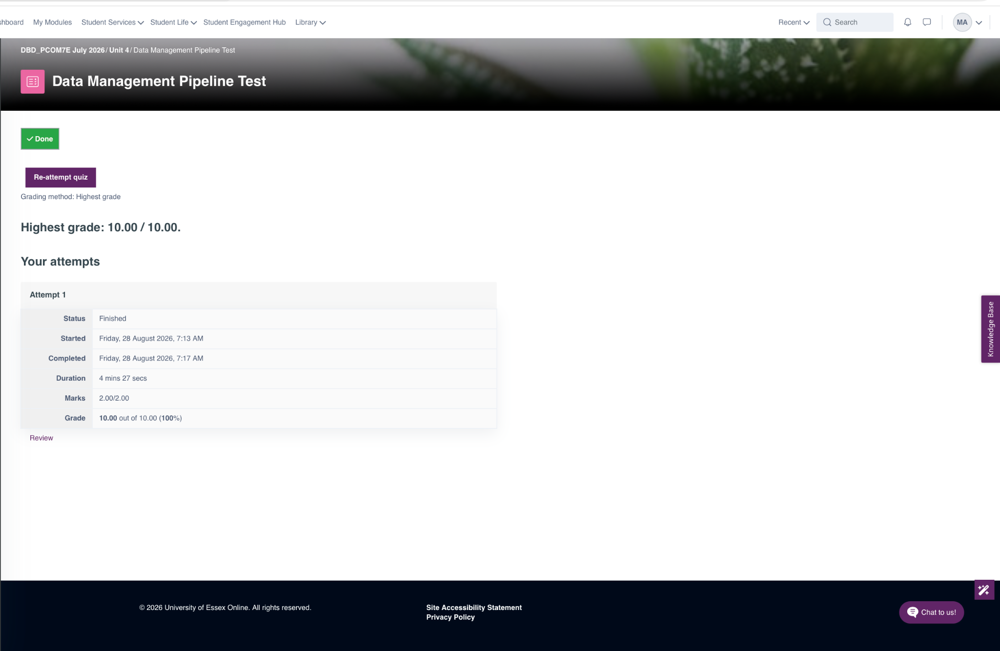
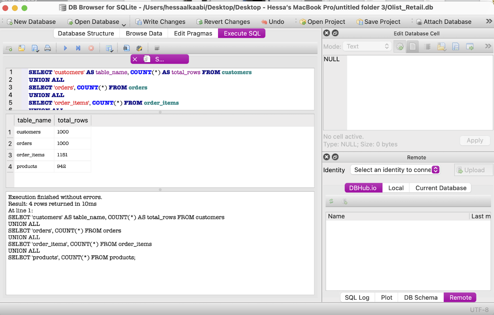
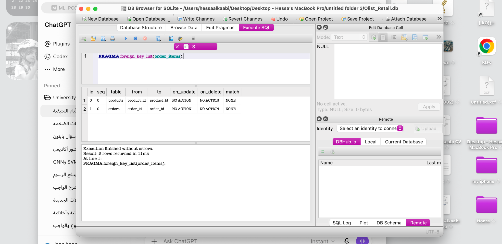
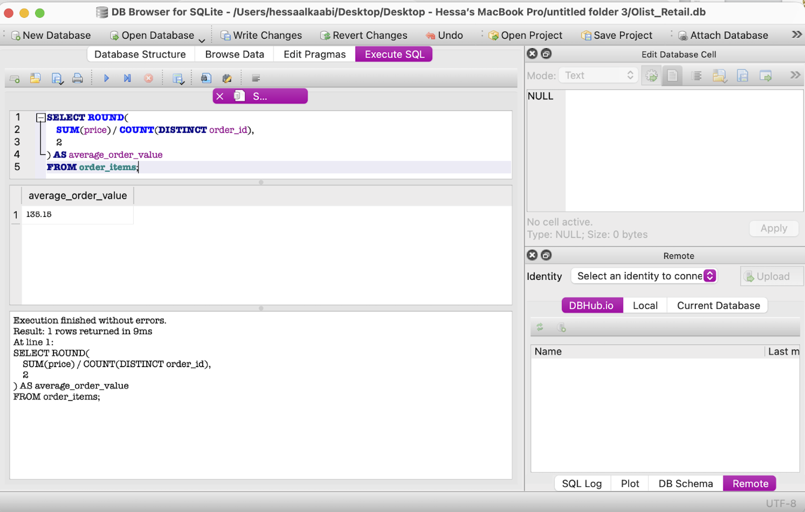
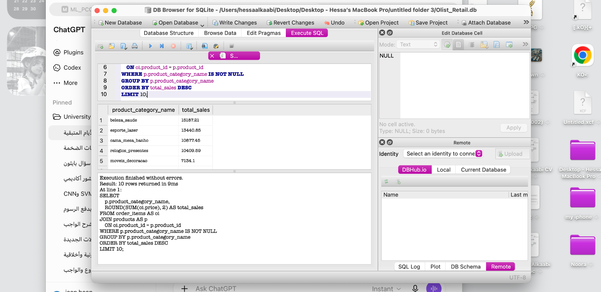

# Deciphering Big Data

## Module Overview

This e-portfolio documents my learning and development throughout the Deciphering Big Data module. It contains selected artefacts from the module activities, collaborative discussions, practical work and assessments, together with reflections on the knowledge and skills I developed.

## Unit 1: Introduction to Big Data Technologies and Data Management

### Collaborative Discussion 1 – The Data Collection Process

In Unit 1, I participated in the collaborative discussion on the use of Internet of Things (IoT) technologies for large-scale data collection. I considered the opportunities provided by connected devices alongside challenges relating to data quality, privacy and security.

The discussion helped me understand that collecting larger volumes of data does not necessarily result in more useful or reliable information. Issues such as missing, inaccurate and duplicated data can affect subsequent analysis and therefore require appropriate data preparation and management.

Peer feedback also encouraged me to consider practical approaches for reducing IoT security risks, including authentication, encryption, software updates and monitoring. This helped me recognise how peer discussion can identify areas where my initial analysis can be developed further.

### Evidence

- Initial post for Collaborative Discussion 1
  

## Unit 2: Introduction to Data Types and Formats

### Collaborative Discussion 1 – Peer Responses

In Unit 2, I continued Collaborative Discussion 1 by responding to my peers' contributions on IoT and large-scale data collection. This activity allowed me to move beyond my initial analysis and critically consider different perspectives on data quality, security and the reliability of IoT data.

Through my peer responses, I explored how continuously generated IoT data requires ongoing monitoring and validation rather than relying only on data cleaning at the final stage of analysis. I also considered how cybersecurity weaknesses can affect not only privacy but also the integrity and reliability of organisational data. This developed my understanding that effective data management requires an integrated approach combining data quality, cybersecurity, privacy protection and continuous risk management.

Engaging with my peers also helped me develop my critical evaluation skills, as I had to compare their arguments with academic literature and provide evidence-based responses rather than simply agreeing or disagreeing.

### Evidence

- Peer response discussing IoT data quality, continuous monitoring and validation.

- Peer response discussing cybersecurity, privacy, data integrity and IoT governance.

## Unit 3: Data Collection and Storage

### Collaborative Discussion 1 – Summary Post

In Unit 3, I completed the final summary post for Collaborative Discussion 1. This activity brought together my learning from Units 1, 2 and 3, as well as the feedback and different perspectives shared during the collaborative discussion.

Through this activity, I developed a better understanding of the opportunities and challenges associated with large-scale data collection and the Internet of Things (IoT). I reflected on the importance of data quality, data preparation, security and privacy when organisations collect information from multiple connected devices and sources.

The discussion also helped me recognise that collecting larger volumes of data does not automatically make the data more useful. Data must be accurate, relevant and appropriately managed before it can support reliable analysis and decision-making.

### Reflection

Completing the summary post helped me connect the ideas discussed throughout the three units. I particularly developed my understanding of how data quality and security need to be considered throughout the data lifecycle rather than as separate issues. Reviewing the discussion and peer contributions also helped me reflect on my original ideas and develop a more balanced understanding of responsible data collection and management.

### Evidence

- Collaborative Discussion 1 – Summary Post

## Unit 4: Data Cleaning and Transformation

### Data Management Pipeline and Data Cleaning

In Unit 4, I developed my understanding of data cleaning and transformation and their role within the data management pipeline. The unit highlighted the importance of preparing data before analysis and considering factors that may affect data quality.

I learned that data cleaning and transformation are important stages in the data pipeline because data may contain errors, inconsistencies or unsuitable formats. Preparing and transforming data helps improve its quality and makes it more appropriate for further analysis.

The unit also introduced the relationship between data management, data cleaning and process automation. This helped me understand that effective data preparation is not simply about correcting individual errors, but about considering how data moves through the wider pipeline.

### Reflection

The Data Management Pipeline Test helped me check my understanding of the concepts covered in this unit. I achieved a score of 10/10 (100%). This demonstrated that I had understood the key concepts relating to the data management pipeline.

The unit has strengthened my understanding of the importance of data quality and preparation. I can also see how these concepts connect with the earlier units, particularly data collection, storage and data wrangling.

### Evidence

- Data Management Pipeline Test result: 10/10 (100%)

## Unit 5: Data Cleaning and Automating Data Collections

### Learning Reflection

In Unit 5, I developed my practical understanding of data cleaning and the use of Python to support data preparation and processing. I worked through the activities in the unit and explored how data can be cleaned, organised and converted into appropriate formats such as CSV.

Through these activities, I gained a better understanding of the importance of identifying data quality issues before analysis. I also explored how Python scripts can be used to automate repetitive data-cleaning tasks. This showed me how automation can improve efficiency, particularly when working with larger datasets where manual processing would be time-consuming.

The unit also helped me understand the importance of clearly defining the inputs, outputs and purpose of an automated process. I learned that automation should be designed around a specific task rather than applied without considering the requirements of the data and the intended outcome.

I also developed my understanding of data models and how they can be used as conceptual representations of relationships between data. Overall, Unit 5 strengthened my understanding of the connection between data cleaning, automation and effective data management, and showed me how Python can support more efficient and reliable data-processing workflows.

# Unit 6 – Database Design and Normalisation

## Introduction

In Unit 6, I developed my understanding of database design, data integrity and normalisation. This unit helped me connect the theoretical concepts of relational databases with the practical database work I completed as part of the project. I worked with the Olist Retail database using DB Browser for SQLite and used SQL queries to inspect the structure of the data and analyse relationships between tables.

## Database Structure

As part of my project work, I examined the main tables within the database. This helped me understand how the dataset was organised and how different types of information were stored separately.

The database contained 1,000 customer records, 1,000 order records, 1,151 order-item records and 942 product records in the sample I examined.

*Figure 1: Checking the number of records in the main database tables.*

This activity helped me understand why database design is important. Separating information into related tables can reduce unnecessary duplication and makes the data easier to manage and analyse.

## Relationships and Foreign Keys

I also investigated the relationships between tables. In particular, I examined the `order_items` table and its foreign-key relationships.

*Figure 2: Foreign-key relationships identified in the order_items table.*

The results showed how `order_items` is connected to other tables through identifiers such as `order_id` and `product_id`. This gave me a clearer practical understanding of primary and foreign keys and how they help maintain relationships between data stored in different tables.

## Using SQL for Data Analysis

After examining the database structure, I used SQL queries to produce useful information from the data. One calculation was the average order value.

*Figure 3: SQL calculation of the average order value.*

The query produced an average order value of 135.15. This demonstrated how data stored across transactional records can be summarised into information that is easier to interpret.

I also analysed sales according to product category.

*Figure 4: SQL analysis of total sales by product category.*

This query grouped the data by product category and calculated total sales for each category. It demonstrated how relationships between tables can be used to support more meaningful analysis rather than examining individual records separately.

## Reflection

This unit improved my understanding of how relational databases are structured and why normalisation is important. Before completing this work, I mainly viewed a database as a place for storing data. Through the unit and the practical project, I developed a better understanding of how tables, primary keys and foreign keys work together to organise data and maintain relationships.

The practical SQL work was particularly useful because it allowed me to apply database concepts to an actual dataset. Examining table structures and relationships helped me understand the importance of designing databases carefully before carrying out analysis.

I also learned that a well-organised database makes analytical queries more effective. By connecting related tables, I was able to calculate measures such as average order value and compare sales across product categories.

Overall, Unit 6 strengthened both my technical SQL skills and my understanding of database design. These skills will be useful when working with larger datasets because good database structure, data integrity and clear relationships are important for producing reliable analysis.

## Unit 7

To be completed.

## Unit 8

To be completed.

## Unit 9

To be completed.

## Unit 10

To be completed.

## Unit 11

To be completed.

## Unit 12

To be completed.

## Final Project Evaluation

To be completed.

## Professional and Personal Development

To be completed.

## Critical Reflection

To be completed.
