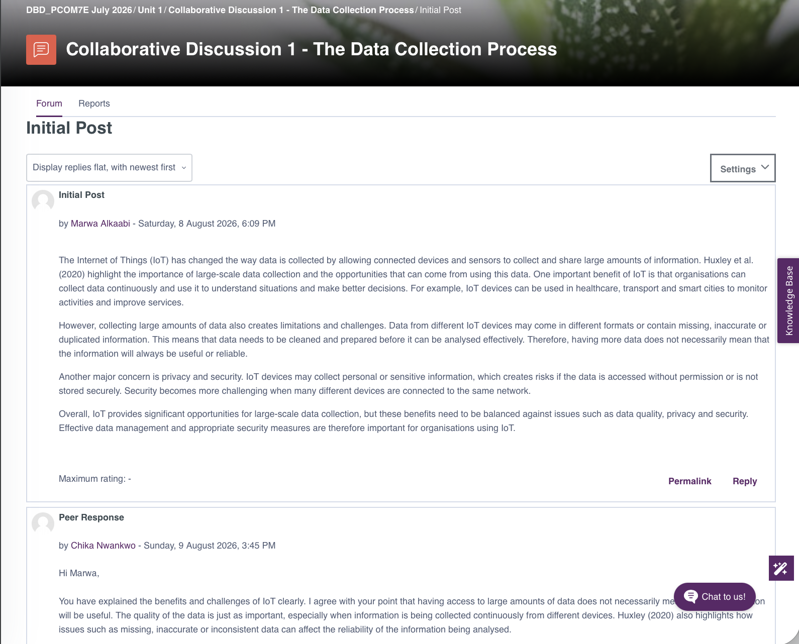
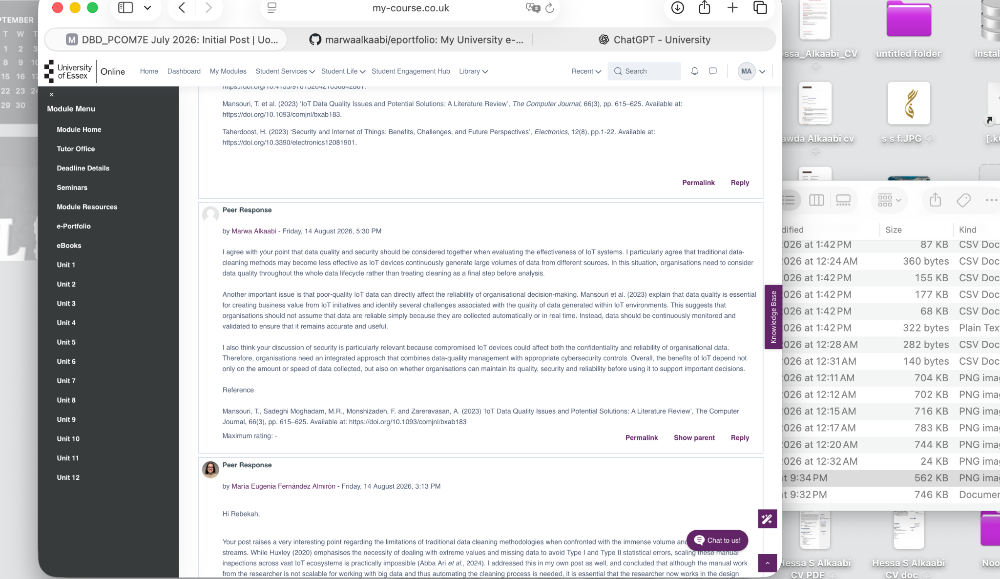
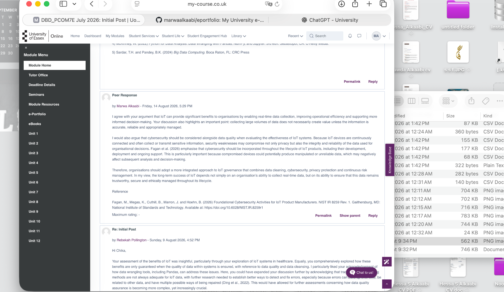
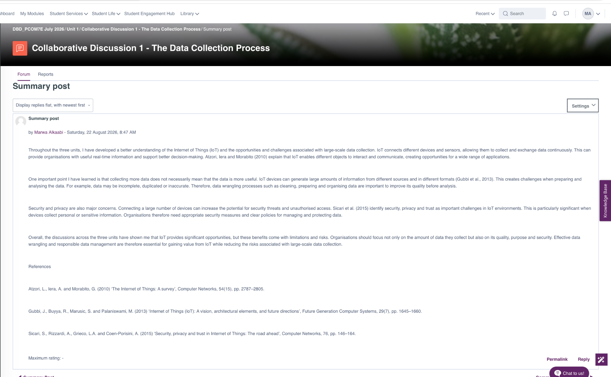
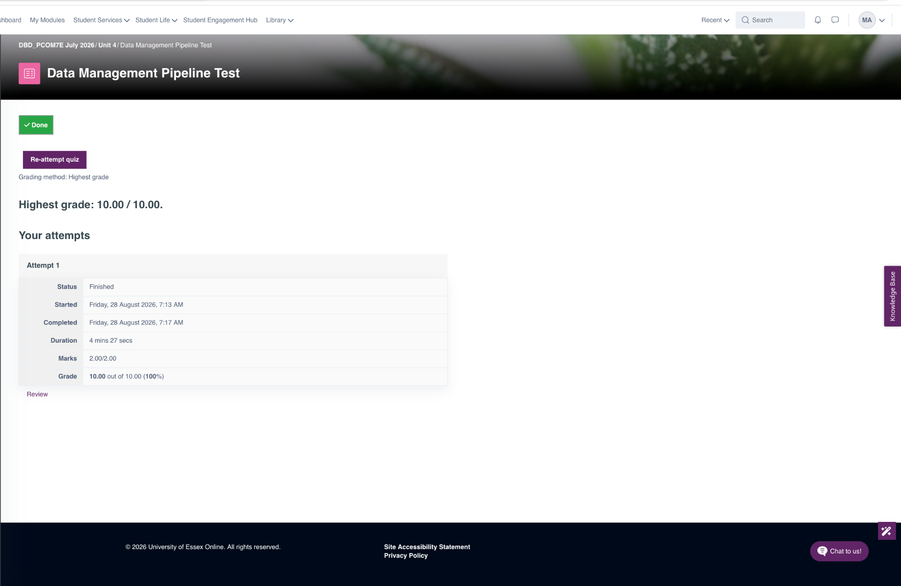
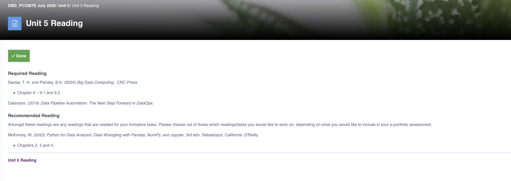
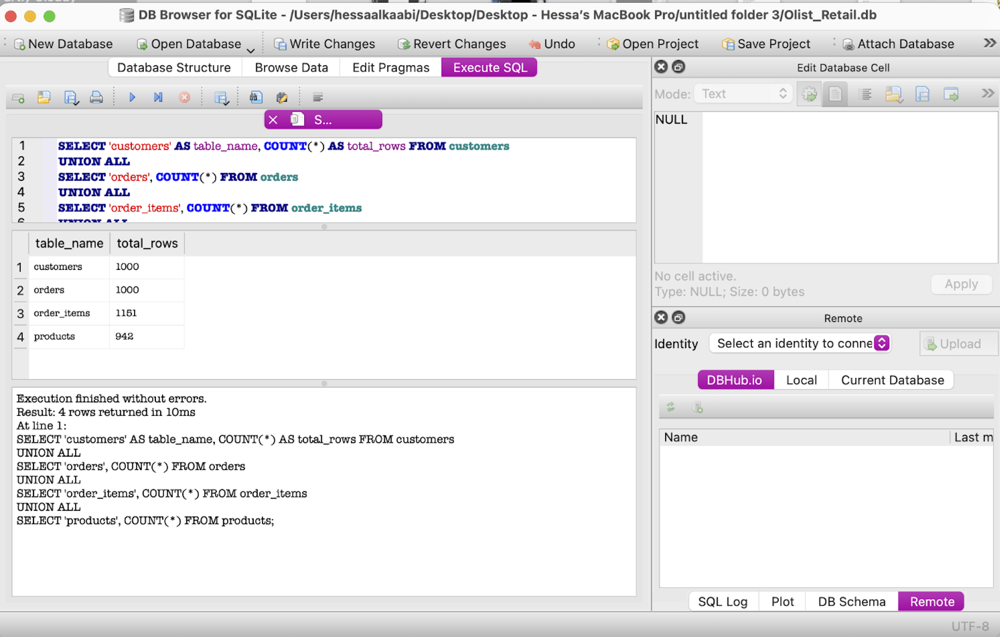
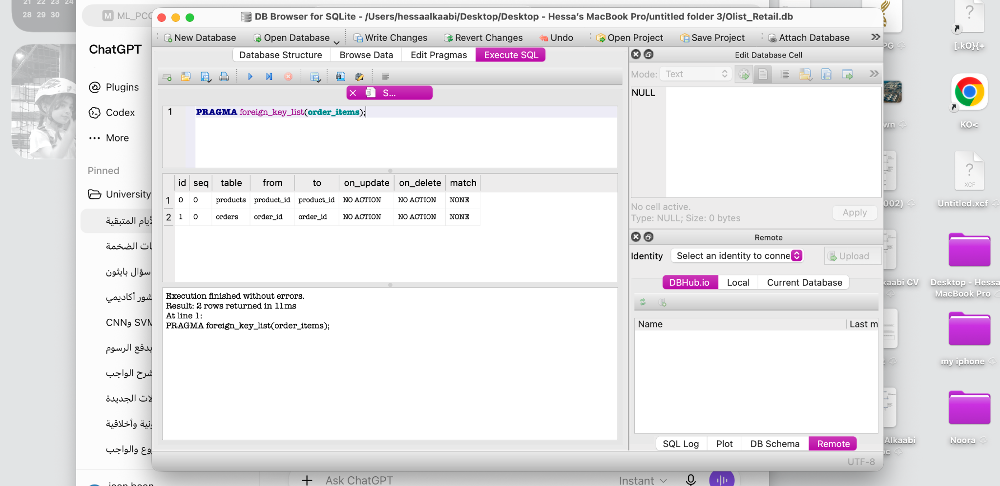
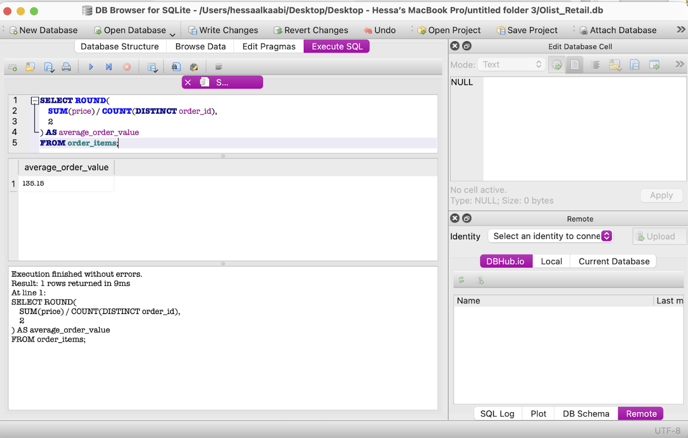
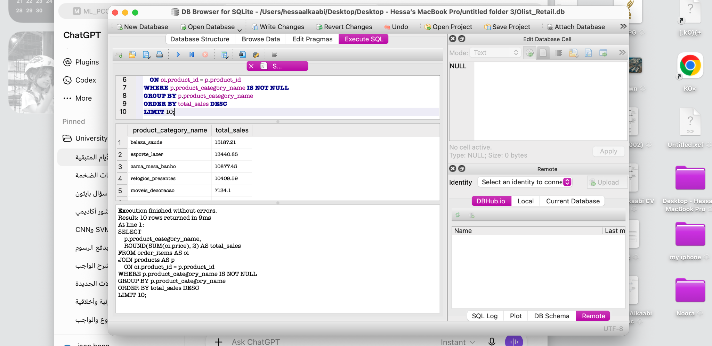

# Deciphering Big Data

## Module Overview

This e-portfolio documents my learning and development throughout the Deciphering Big Data module. It contains selected artefacts from the module activities, collaborative discussions, practical work and assessments, together with reflections on the knowledge and skills I developed.

## Unit 1: Introduction to Big Data Technologies and Data Management

### Collaborative Discussion 1 – The Data Collection Process

In Unit 1, I participated in the collaborative discussion on the use of Internet of Things (IoT) technologies for large-scale data collection. I considered the opportunities provided by connected devices alongside challenges relating to data quality, privacy and security.

The discussion helped me understand that collecting larger volumes of data does not necessarily result in more useful or reliable information. Issues such as missing, inaccurate and duplicated data can affect subsequent analysis and therefore require appropriate data preparation and management.

Peer feedback also encouraged me to consider practical approaches for reducing IoT security risks, including authentication, encryption, software updates and monitoring. This helped me recognise how peer discussion can identify areas where my initial analysis can be developed further.

### Evidence

- Initial post for Collaborative Discussion 1
  

## Unit 2: Introduction to Data Types and Formats

### Collaborative Discussion 1 – Peer Responses

In Unit 2, I continued Collaborative Discussion 1 by responding to my peers' contributions on IoT and large-scale data collection. This activity allowed me to move beyond my initial analysis and critically consider different perspectives on data quality, security and the reliability of IoT data.

Through my peer responses, I explored how continuously generated IoT data requires ongoing monitoring and validation rather than relying only on data cleaning at the final stage of analysis. I also considered how cybersecurity weaknesses can affect not only privacy but also the integrity and reliability of organisational data. This developed my understanding that effective data management requires an integrated approach combining data quality, cybersecurity, privacy protection and continuous risk management.

Engaging with my peers also helped me develop my critical evaluation skills, as I had to compare their arguments with academic literature and provide evidence-based responses rather than simply agreeing or disagreeing.

### Evidence

- Peer response discussing IoT data quality, continuous monitoring and validation.

- Peer response discussing cybersecurity, privacy, data integrity and IoT governance.

## Unit 3: Data Collection and Storage

### Collaborative Discussion 1 – Summary Post

In Unit 3, I completed the final summary post for Collaborative Discussion 1. This activity brought together my learning from Units 1, 2 and 3, as well as the feedback and different perspectives shared during the collaborative discussion.

Through this activity, I developed a better understanding of the opportunities and challenges associated with large-scale data collection and the Internet of Things (IoT). I reflected on the importance of data quality, data preparation, security and privacy when organisations collect information from multiple connected devices and sources.

The discussion also helped me recognise that collecting larger volumes of data does not automatically make the data more useful. Data must be accurate, relevant and appropriately managed before it can support reliable analysis and decision-making.

### Reflection

Completing the summary post helped me connect the ideas discussed throughout the three units. I particularly developed my understanding of how data quality and security need to be considered throughout the data lifecycle rather than as separate issues. Reviewing the discussion and peer contributions also helped me reflect on my original ideas and develop a more balanced understanding of responsible data collection and management.

### Evidence

- Collaborative Discussion 1 – Summary Post

## Unit 4: Data Cleaning and Transformation

### Data Management Pipeline and Data Cleaning

In Unit 4, I developed my understanding of data cleaning and transformation and their role within the data management pipeline. The unit highlighted the importance of preparing data before analysis and considering factors that may affect data quality.

I learned that data cleaning and transformation are important stages in the data pipeline because data may contain errors, inconsistencies or unsuitable formats. Preparing and transforming data helps improve its quality and makes it more appropriate for further analysis.

The unit also introduced the relationship between data management, data cleaning and process automation. This helped me understand that effective data preparation is not simply about correcting individual errors, but about considering how data moves through the wider pipeline.

### Reflection

The Data Management Pipeline Test helped me check my understanding of the concepts covered in this unit. I achieved a score of 10/10 (100%). This demonstrated that I had understood the key concepts relating to the data management pipeline.

The unit has strengthened my understanding of the importance of data quality and preparation. I can also see how these concepts connect with the earlier units, particularly data collection, storage and data wrangling.

### Evidence

- Data Management Pipeline Test result: 10/10 (100%)

## Unit 5 – Data Pipeline Automation and Data Wrangling

### Overview
Unit 5 introduced important concepts related to big data computing, data pipeline automation, and data wrangling using Python. The reading materials focused on how data pipelines support the movement and processing of data and how tools such as Pandas and NumPy can be used to prepare datasets for analysis.

### Key Learning Topics
- Understanding the purpose of data pipelines in big data environments.
- Exploring how automation can improve data processing workflows.
- Understanding the role of Python, Pandas, and NumPy in data preparation.
- Recognising the importance of data quality and efficient data processing.

### Reflection
The topics introduced in this unit highlighted the importance of organising data processing workflows. Data pipeline automation is particularly relevant when working with large datasets because it can reduce repetitive manual tasks and improve consistency. These concepts provide a foundation for understanding more advanced data processing techniques.

### Evidence

This screenshot shows the reading materials provided for Unit 5, covering Big Data Computing, Data Pipeline Automation, and Python-based Data Wrangling. These resources introduce important concepts related to data processing, automation, and preparing data for analysis.

# Unit 6 – Database Design and Normalisation

## Introduction

In Unit 6, I developed my understanding of database design, data integrity and normalisation. This unit helped me connect the theoretical concepts of relational databases with the practical database work I completed as part of the project. I worked with the Olist Retail database using DB Browser for SQLite and used SQL queries to inspect the structure of the data and analyse relationships between tables.

## Database Structure

As part of my project work, I examined the main tables within the database. This helped me understand how the dataset was organised and how different types of information were stored separately.

The database contained 1,000 customer records, 1,000 order records, 1,151 order-item records and 942 product records in the sample I examined.

*Figure 1: Checking the number of records in the main database tables.*

This activity helped me understand why database design is important. Separating information into related tables can reduce unnecessary duplication and makes the data easier to manage and analyse.

## Relationships and Foreign Keys

I also investigated the relationships between tables. In particular, I examined the `order_items` table and its foreign-key relationships.

*Figure 2: Foreign-key relationships identified in the order_items table.*

The results showed how `order_items` is connected to other tables through identifiers such as `order_id` and `product_id`. This gave me a clearer practical understanding of primary and foreign keys and how they help maintain relationships between data stored in different tables.

## Using SQL for Data Analysis

After examining the database structure, I used SQL queries to produce useful information from the data. One calculation was the average order value.

*Figure 3: SQL calculation of the average order value.*

The query produced an average order value of 135.15. This demonstrated how data stored across transactional records can be summarised into information that is easier to interpret.

I also analysed sales according to product category.

*Figure 4: SQL analysis of total sales by product category.*

This query grouped the data by product category and calculated total sales for each category. It demonstrated how relationships between tables can be used to support more meaningful analysis rather than examining individual records separately.

## Project Development and Change of Direction

My initial project idea focused on developing an AI-assisted relational database for a custodian bank to support Collateralised Loan Obligations (CLOs). However, I later decided to change the project to an e-commerce database analytics solution using the Olist dataset.

The final project focused on designing and implementing a relational database using SQLite, including data preparation, primary and foreign key relationships, data integrity checks, and SQL-based sales analysis.

This change allowed me to develop practical experience in relational database design, data cleaning, and analysing transactional data. The completed Olist project demonstrates the application of these techniques to a real-world dataset.

## Reflection

Unit 6 provided an opportunity to apply database design and SQL techniques to a practical project. Working with the Olist E-Commerce dataset helped me understand how relational databases can organise transactional information and support meaningful business analysis.

One of the important aspects of this project was preparing the data and ensuring that the relationships between tables were accurate. I worked with customer, order, product, and order item data, using primary and foreign keys to maintain referential integrity. I also used SQL queries to explore sales patterns and extract useful information.

Changing my initial project idea helped me recognise the importance of selecting a dataset that supports practical implementation and evaluation. Through the completed project, I developed my understanding of data preparation, relational database structures, SQL analysis, and the importance of validating results.

This experience provided a foundation for applying database analytics techniques to future projects.

## Unit 7

## Unit 7 – Constructing Normalised Tables and Database Build

### Normalisation Task

#### Introduction

This task involves converting an unnormalised student dataset into First Normal Form (1NF), Second Normal Form (2NF), and Third Normal Form (3NF).

The original dataset contains student numbers, student names, exam scores, support information, dates of birth, course names, examination boards, and teacher names.

The aim is to reduce data redundancy, improve data consistency, and organise the information into a relational database structure.

#### Step 1: First Normal Form (1NF)

The original table contains multiple course names, examination boards, and teacher names within individual cells. This violates the atomicity requirement of First Normal Form.

To achieve 1NF, repeating groups are separated into individual rows, ensuring that each field contains a single value.

**Example of the 1NF table:**

| Student Number | Student Name | Course Name | Exam Board |
|---|---|---|---|
| 1001 | Bob Baker | Computer Science | BCS |
| 1001 | Bob Baker | Maths | EdExcel |
| 1001 | Bob Baker | Physics | OCR |
| 1002 | Sally Davies | Maths | AQA |
| 1002 | Sally Davies | Biology | WJEC |
| 1002 | Sally Davies | Music | AQA |

This transformation ensures that each cell contains a single value. However, student information is still repeated across multiple rows, which will be addressed in Second Normal Form.

**Assumption:** The exam score is treated as a student-level attribute because the original table provides one score per student rather than a separate score for each course.

#### Step 2: Second Normal Form (2NF)

Second Normal Form (2NF) requires the table to be in 1NF and ensures that non-key attributes depend on the entire primary key rather than only part of it.

In the original student dataset, student details are repeated for every course. To reduce this redundancy, the data can be separated into two tables: Students and StudentCourses.

**Table 1: Students**

| Student Number (PK) | Student Name | Exam Score | Support | Date of Birth |
|---|---|---|---|---|
| 1001 | Bob Baker | 78 | No | 25/08/2001 |
| 1002 | Sally Davies | 55 | Yes | 02/10/1999 |
| 1003 | Mark Hamnill | 90 | No | 05/06/1995 |
| 1004 | Anas Ali | 70 | No | 03/08/1980 |
| 1005 | Cheuk Yin | 45 | Yes | 01/05/2002 |

**Table 2: StudentCourses**

| Student Number (FK) | Course Name | Exam Board | Teacher Name |
|---|---|---|---|
| 1001 | Computer Science | BCS | Mr Jones |
| 1001 | Maths | EdExcel | Ms Parker |
| 1001 | Physics | OCR | Mr Peters |
| 1002 | Maths | AQA | Ms Parker |
| 1002 | Biology | WJEC | Mrs Patel |
| 1002 | Music | AQA | Ms Daniels |

The Students table uses Student Number as its primary key. In StudentCourses, the combination of Student Number and Course Name can be used as a composite key, assuming each student takes each course only once.

This structure reduces repeated student information and separates student-level attributes from course enrolment records.

The StudentCourses table is an intermediate design. Further analysis of dependencies between courses, teachers, and examination boards is required before confirming Third Normal Form.

#### Step 3: Third Normal Form (3NF)

Third Normal Form (3NF) requires the database to satisfy 2NF and eliminate transitive dependencies, where non-key attributes depend on other non-key attributes rather than directly on the primary key.

In the student dataset, teacher names are associated with particular courses. Storing teacher information repeatedly in the StudentCourses table creates unnecessary duplication.

To improve the database structure, the information can be organised into three related tables.

**Table 1: Students**

| Student Number (PK) | Student Name | Exam Score | Support | Date of Birth |
|---|---|---|---|---|
| 1001 | Bob Baker | 78 | No | 25/08/2001 |
| 1002 | Sally Davies | 55 | Yes | 02/10/1999 |
| 1003 | Mark Hamnill | 90 | No | 05/06/1995 |
| 1004 | Anas Ali | 70 | No | 03/08/1980 |
| 1005 | Cheuk Yin | 45 | Yes | 01/05/2002 |

**Table 2: Courses**

| Course ID (PK) | Course Name | Teacher Name |
|---|---|---|
| C01 | Computer Science | Mr Jones |
| C02 | Maths | Ms Parker |
| C03 | Physics | Mr Peters |
| C04 | Biology | Mrs Patel |
| C05 | Music | Ms Daniels |

**Table 3: StudentCourses**

| Student Number (FK) | Course ID (FK) | Exam Board |
|---|---|---|
| 1001 | C01 | BCS |
| 1001 | C02 | EdExcel |
| 1001 | C03 | OCR |
| 1002 | C02 | AQA |
| 1002 | C04 | WJEC |
| 1002 | C05 | AQA |

The StudentCourses table uses a composite primary key consisting of Student Number and Course ID, assuming that each student is enrolled in each course only once.

The Students table stores student-level information, while the Courses table stores course and teacher details. StudentCourses links students to their courses and records the relevant examination board.

This design reduces repeated student and teacher information and helps prevent update anomalies.

**Design assumptions and limitations:**

- Each course is assumed to have one assigned teacher.
- Exam Board is retained in StudentCourses because the same course may use different examination boards.
- The Course IDs are introduced for the proposed database design.
- The tables illustrate a subset of the original data. The remaining student-course records would also need to be included in a complete implementation.

#### Normalisation Task Reflection

This task helped me understand how database normalisation can improve the organisation and consistency of data. By examining the original student dataset, I identified repeating groups and explored how they could be separated into related tables.

Moving through 1NF, 2NF and 3NF demonstrated the importance of primary keys, foreign keys and functional dependencies. It also highlighted that database design requires careful consideration of the relationships and assumptions within the data.

The normalisation process provided useful knowledge for designing relational databases and reducing unnecessary data duplication.

## Data Build Task – Unit 7

### Objective

The Data Build Task required a relational database to be constructed from the normalised student dataset, with linked tables, primary and foreign keys, and referential-integrity testing.

### Database implementation

I prepared a SQLite database design with three linked tables: `Students`, `Courses` and `StudentCourses`. The `Students` table contains student details and one exam score per student, reflecting the original source. The `Courses` table contains course names and teacher names. `StudentCourses` connects students to courses and records the examination board for each enrolment.

The database contains **5 students, 5 courses and 15 student-course records** based on the university task screenshot. `student_number` and `course_id` serve as primary keys in their respective tables, and the composite key (`student_number`, `course_id`) prevents duplicate enrolments. Foreign keys enforce valid links between the tables.

### SQL validation and evidence

The SQL script includes record-count queries, a three-table `JOIN`, and `PRAGMA foreign_key_check`. When the supplied SQLite database was tested, the counts were 5, 5 and 15 respectively, and `PRAGMA foreign_key_check` returned no violations. A test insertion referencing a nonexistent student was also rejected by the database, demonstrating enforcement of foreign-key constraints.

**Evidence files:**

- [SQLite database](unit7_normalisation.db)
- [SQL build and validation script](unit7_database_build.sql)

### Design assumptions and limitations

The university task provides one exam score per student, so it is stored in `Students` rather than being treated as a course-level score. The source associates one teacher with each course, which is assumed to be consistent across students. Examination boards vary for Maths and are therefore recorded for each student-course enrolment. Course IDs were introduced as surrogate identifiers. These assumptions should be reconsidered if more detailed source data become available.

### Reflection

Building this database helped me connect the theory of normalisation with relational database implementation. I explored how separating student details, course details and enrolment records reduces repetition, while primary and foreign keys help maintain data integrity. The validation queries also showed why database testing is necessary before relying on data for analysis.

*Note: The database and script are a worked implementation prepared from the Unit 7 task screenshot; the screenshot alone does not demonstrate that the database was previously built in the university activity.*

## Unit 8

To be completed.

## Unit 9

To be completed.

## Unit 10

To be completed.

## Unit 11

To be completed.

## Unit 12

To be completed.

## Final Project Evaluation

To be completed.

## Professional and Personal Development

To be completed.

## Critical Reflection

To be completed.
